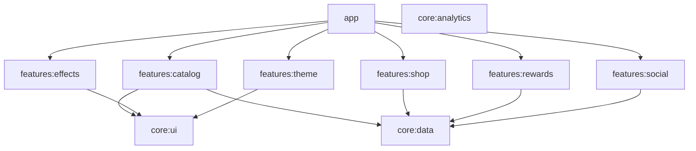

# SugarMunch Architecture

## Overview

SugarMunch is an Android multi-module app (app, wear, tv) with a single main application module that hosts UI, data, and feature logic. This document describes the current and target architecture.

## Phase 1 Theme Convergence

Phase 1 introduces a canonical `ThemeProfile` pipeline under `app/src/main/kotlin/com/sugarmunch/app/theme/profile/`.

- Editors, transport, layering, typography, and per-app overrides now target `ThemeProfile`
- `ThemeManager` remains the runtime coordinator, but reads from `ThemeProfileRepository` instead of owning theme serialization directly
- `CandyTheme` is still used at runtime for compatibility, but is now a resolved output format
- App-scoped routes (`detail`, `preview`, `utility-studio`) are wrapped in scoped theme resolution so per-app overrides can be applied without changing the catalog grid theme

See `docs/adr/0001-canonical-theme-profile.md` for the architectural decision record.

## Current Structure

```
SugarMunch/
├── app/          # Main Android app (Compose, Hilt, Room, Firebase)
├── wear/         # Wear OS module (version catalog)
├── tv/           # Android TV module (depends on app)
└── docs/         # Documentation
```

**Data flow (current):**

- **UI** (Compose screens) → **ViewModel** → **Repository** / **Manager** → **Room** or **Network** (Retrofit/OkHttp)
- **DI:** Hilt in `app/di/AppModule.kt` provides Database, Repositories, and managers
- **Data:** Room (`AppDatabase`, `PassDatabase`), DataStore for preferences, JSON manifest from GitHub raw

## Target Modular Architecture

Planned feature and core modules for clearer boundaries and build times:



- **:features:catalog** – Catalog UI and ViewModel
- **:features:effects** – Effect engine and effect screens
- **:features:theme** – Theme engine and theme screens
- **:features:shop** – Shop and economy
- **:features:rewards** – Daily rewards
- **:features:social** – Clan, trading, P2P
- **:core:ui** – Compose theme, base components, design tokens
- **:core:data** – Room, Repositories, DataStore
- **:core:analytics** – Firebase, logging

**Rules:** Feature modules depend only on core; no feature-to-feature dependencies; app depends on all feature modules.

## Key Decisions

| Decision | Rationale |
|----------|-----------|
| Hilt for DI | Single source of truth for singletons; testability |
| Room + fallbackToDestructiveMigration only in debug | Production uses migrations; see Phase 2 |
| Single manifest URL (GitHub raw) | Catalog and app list from one JSON; pinning in network_security_config |
| SecureLogger for crash paths | Avoid leaking sensitive data in logs; see Phase 1 |
| Certificate pinning for GitHub only | Firebase/Google use system CAs; reduces pin rotation surface |

## Database

- **AppDatabase** (`sugarmunch_db`): Main app cache, predictions, clan, automation. Version 7, migrations in place.
- **PassDatabase** (`sugar_pass_db`): Sugar Pass progress, seasons, XP. Version 2, migrations in place.
- Schema is exported (`exportSchema = true`) under `app/schemas/` for migration authoring.

## Security

- **APK verification:** `ApkSignatureVerifier` + `SecurityConfig.TRUSTED_CERTIFICATE_HASHES` (must be set for release).
- **Plugin verification:** `PluginSecurity.verifyManifestSignature` validates cert issuer against trusted authorities.
- **Network:** `network_security_config.xml` pins GitHub; see `docs/SECURING_RELEASE.md`.

## References

- [SECURING_RELEASE.md](SECURING_RELEASE.md) – Release signing and pin rotation
- [IMPLEMENTATION_PLAN.md](../IMPLEMENTATION_PLAN.md) – Phase and feature list
- [AGENTS.md](../AGENTS.md) – Project and tech stack summary
